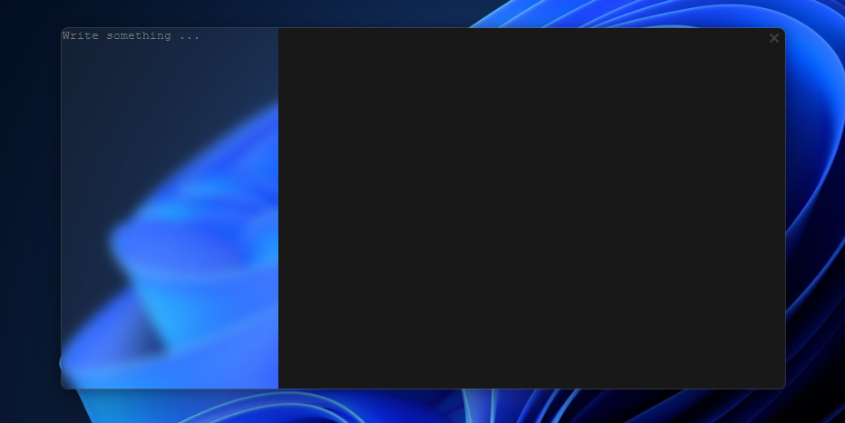
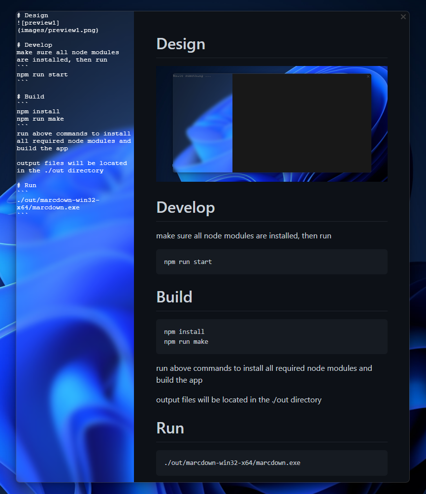

# Design




# Develop
make sure all node modules are installed, then run
```
npm run start
```

# Build
```
npm install
npm run make
```
run above commands to install all required node modules and build the app

output files will be located in the ./out directory

# Run
```
./out/marcdown-win32-x64/marcdown.exe
```
